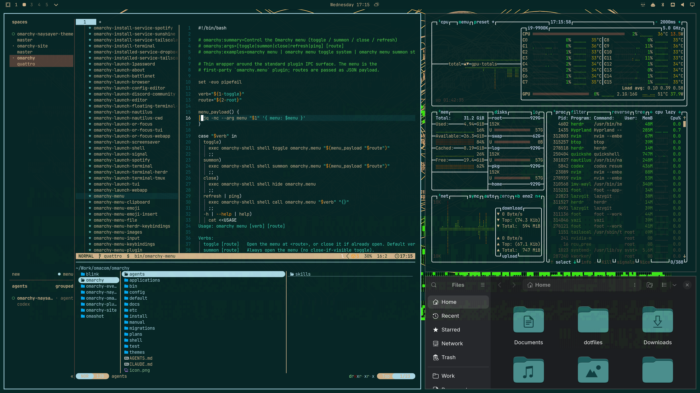
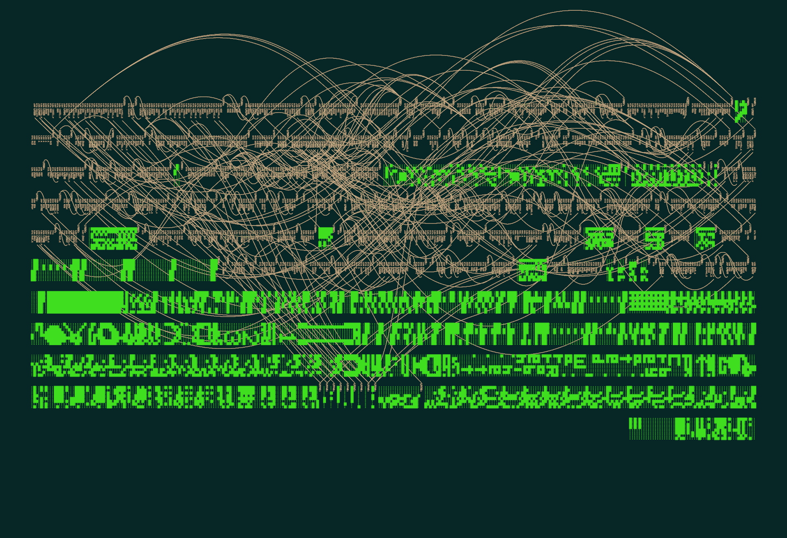

# Naysayer

A theme based on Jonathan Blow's personal Emacs setup.

The backgrounds come from the same [art series](https://www.benfry.com/distellamap/) as a framed print that Jon keeps on his wall.

